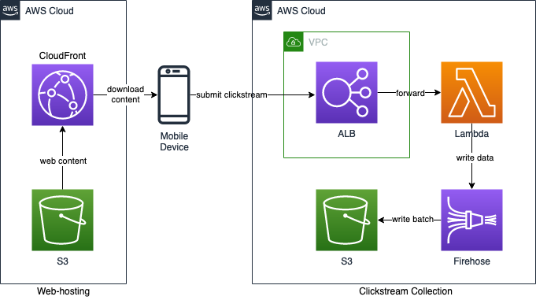

# Clickstream Collector
[](/LICENSE) 

AWS infrastructure to collect a mobile app's click-stream and geolocations.

# Introduction

AWS produced an intelligent Youtube video series called **This is My Architecture**. One of videos titled as [HK01: Serverless Analytics for Clickstreams Analysis](https://youtu.be/yPJf85tjv6M) describes about an architecture of clickstream collection in [HK01](https://www.hk01.com/), which is one of top online media in HK.

Although there are many proprietary products, such as [Adobe](https://business.adobe.com/) and [SalesForce](https://www.salesforce.com), providing a feature of clickstream collection in the market, building such a serverless architecture on your own can still enjoy the following benefits:
- Highly scalable to process a large amount of data
- Less in-house infrastructure maintenance effort
- Cost effective, especially for unpredictable network traffic

Inspired by the video, I have created this techinical stack for clickstream collection based on ALB, Lambda Function and Kinesis Firehose.

# Architecture



- CloudFront + S3 hosts a webapp to simulate a mobile app front end.
- ALB: A scalable endpoint to receive clickstream from mobile apps.
- Lambda function: ALB forwards the clickstream payload to the Lambda function. The function structures the payload data.
- Kinesis Firehose as a delivery stream to collect structural data from the Lambda function. It dumps a batch of data into an S3 bucket in a regular schedule.

# Repository
- [cloudformation](/cloudformation): Cloudformation Templates for deployment
- [kstream-collector](/kstream-collector): Lambda function to collect click-stream and geolocations from ALB
- [react-touchwood](/react-touchwood): Touchwood App as a Demo web-app to show how to use clickstream collector
- [terraform](/terraform): Terraform scripts for deployment
- [build_upload_fe.sh](/build_upload_fe.sh): Shell script to build and upload the frontend webapp as well as the web-hosting infrastructure
- [build_upload_lf.sh](/build_upload_lf.sh): Shell script to build and upload the Lambda function as well as the clickstream collection infrastructure

# Perquisite
- Install [jq](https://stedolan.github.io/jq/)
- Install [AWS CLI](https://aws.amazon.com/cli/)
- Define clickstream tags in the frontend. In this demo, we use:

| Tag | Value | Description |
| --- | ----- | ----------- |
| GEO_LOC | Geolocation | Geolocation of the client |
| CLICK_LANG | Lang. Code | Which language is displayed |
| LIKE_WOOD | Wood Index | Which wood is liked |
| UNLIKE_WOOD | Wood Index | Which wood is unliked |

- Define a file of environment variables `.env.local`:

| Variable | Description |
| -------- | ----------- |
| AWS_REGION | AWS Region to be deployed |
| KSTREAM_STACK | Stack name of Clickstream Collection |
| LAMBDA_CODE_BUCKET | S3 Bucket to store Lambda code |
| LAMBDA_CODE_PATH | S3 Key Prefix to store Lambda code |
| VPC_ID | VPC ID of ALB |
| ELB_SUBNETS | Subnet IDs of ALB (comma delimited) |
| DATA_BUCKET | S3 Bucket to store Firehose output |
| DATA_PREFIX | S3 Key Prefix to store Firehose output |
| WEBAPP_STACK | Stack name of Webapp hosting |
| WEBAPP_BUCKET | S3 Bucket (public) to store Webapp hosting |

# Build and Deploy
```bash
./build_upload_lf.sh -e .env.local   
./build_upload_fe.sh -e .env.local   
```
After `build_upload_lf.sh` is done, the domain name of ALB is displayed. The value is also written as `react-touchwood/.env.production.local`. After `build_upload_fe.sh` is done, the domain name of CloudFront is displayed.

# Output
Kinesis Firehose delivers a batch of clickstream data into a defined S3 bucket. The format is multi-document JSON. JSON objects are packed together like the below:
```JSON
{"token": "fkxnjuxdn8j0czwl", "timestamp": "2022-02-22T18:37:19.783Z", "tag": "CLICK_LANG", "value": "en", "client_id": "touchwood-app", "client_ip": "90.200.187.19, 165.225.197.24", "user_agent": "Mozilla/5.0 (iPhone; CPU iPhone OS 10_3_1 like Mac OS X) AppleWebKit/603.1.30 (KHTML, like Gecko) Version/10.0 Mobile/14E304 Safari/602.1"}{"token": "fkxnjuxdn8j0czwl", "timestamp": "2022-02-22T18:37:28.205Z", "tag": "LIKE_WOOD", "value": 3, "client_id": "touchwood-app", "client_ip": "90.200.187.19, 165.225.197.24", "user_agent": "Mozilla/5.0 (iPhone; CPU iPhone OS 10_3_1 like Mac OS X) AppleWebKit/603.1.30 (KHTML, like Gecko) Version/10.0 Mobile/14E304 Safari/602.1"}{"token": "fkxnjuxdn8j0czwl", "timestamp": "2022-02-22T18:37:31.149Z", "tag": "LIKE_WOOD", "value": 4, "client_id": "touchwood-app", "client_ip": "90.200.187.19, 165.225.197.24", "user_agent": "Mozilla/5.0 (iPhone; CPU iPhone OS 10_3_1 like Mac OS X) AppleWebKit/603.1.30 (KHTML, like Gecko) Version/10.0 Mobile/14E304 Safari/602.1"}{"token": "fkxnjuxdn8j0czwl", "timestamp": "2022-02-22T18:37:54.363Z", "tag": "CLICK_LANG", "value": "hk", "client_id": "touchwood-app", "client_ip": "90.200.187.19, 165.225.197.24", "user_agent": "Mozilla/5.0 (iPhone; CPU iPhone OS 10_3_1 like Mac OS X) AppleWebKit/603.1.30 (KHTML, like Gecko) Version/10.0 Mobile/14E304 Safari/602.1"}
```

[AWS advise](https://docs.aws.amazon.com/firehose/latest/dev/record-format-conversion.html) to use either [Apache Hive JSON SerDe](https://cwiki.apache.org/confluence/display/Hive/LanguageManual+DDL#LanguageManualDDL-JSON) or [OpenX JSON SerDe](https://github.com/rcongiu/Hive-JSON-Serde) to deserialize the content.

# Appendix A - Terraform
Terraform is provided as alternative to Cloudformation for the stacks. Refer [terraform](/terraform) folder for detail.

# Appendix B - Frontend
A fun webapp *Touchwood App* is built for clickstream collection demo. Refer [react-touchwood](/react-touchwood) folder for detail.

# Appendix C - Common commands
- Delete a Cloudformation stack with emptying the buckets
```bash
aws s3 rb s3://<BUCKET_NAME> --force
aws s3 rb s3://<BUCKET_NAME>-log --force
aws cloudformation delete-stack --stack-name <STACK_NAME>
```

# Change History
- 22 Feb 2022 : First Release

# Author
- Teki Chan *tekichan@gmail.com*
