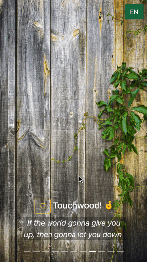

# React Touchwood

This web app is inspired by a TV programme called [In Geek We Trust](https://en.wikipedia.org/wiki/In_Geek_We_Trust). An app called **Touchwood App** was used for fun inside the programme.



> My mother advised me to TOUCHWOOD when saying bad luck. Like me, we may say many things wrong and experience unlucky stuff everyday but cannot always find wood to TOUCHWOOD.
>
> There is a saying that a tree is of spirtuality and you will get good luck if you touch it. This app posseses various wood for TOUCHWOOD.
>
> Not only for saying something wrong, but also good for leisure or bringing good luck.
>
> Let's try, even though it sounds useless in your sense.
>
> *- Never @ In Geek We Trust*

> (Cantonese)
>
> 我阿媽話「講錯嘢要 Touchwood」。好似我咁。每日都講錯好多嘢，每日都發生好多唔如意嘅事，但就每次都搵唔到塊wood嚟touch。
>
> 有人話「樹木喺有靈性，touch一下就會有好運」，呢個app入面就有好多款wood可以touch。
>
> 有時唔只喺講錯嘢，得閒touch下都好，或者都會帶來好運。
>
> 大家都try try，就算明知無用都好。
>
> *- Never @ IT狗*

# NPM Packages
Install packages in `package.json` by the command `npm install`.

Or install from scratch after [create-react-app](https://reactjs.org/docs/create-a-new-react-app.html)
```bash
npm install react-bootstrap bootstrap
npm install bootstrap-icons
npm install --save-dev miragejs
npm install jsrsasign
```

# Credits
All images are from [Unsplash](https://unsplash.com/).
